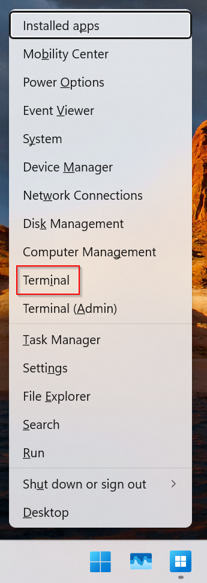
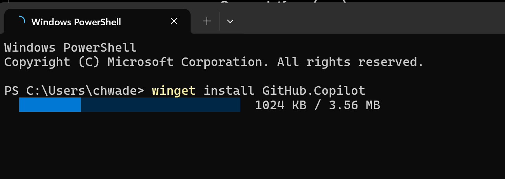
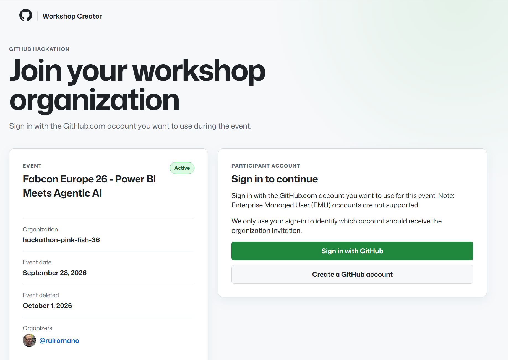
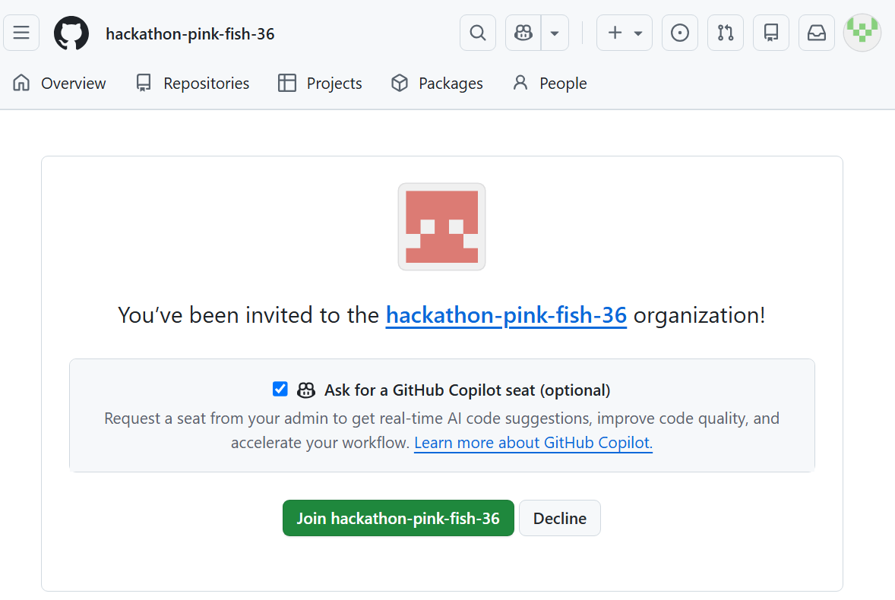
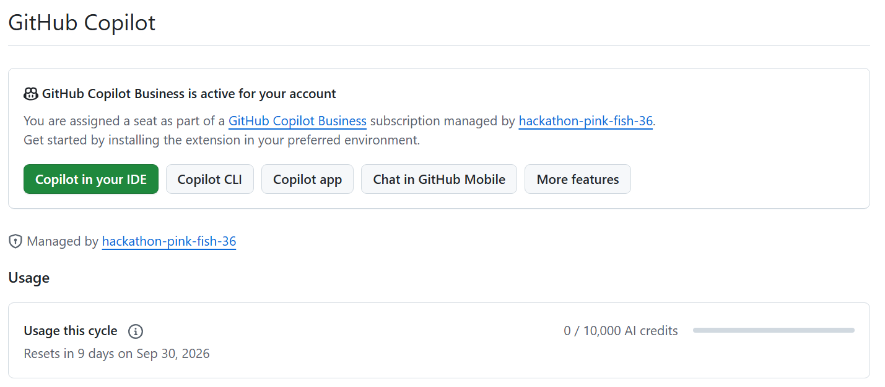
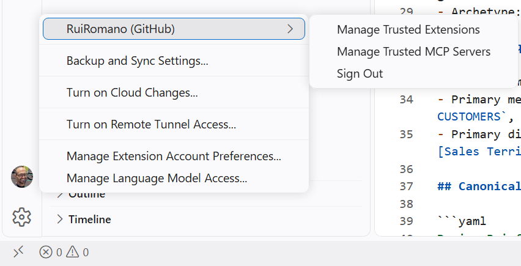
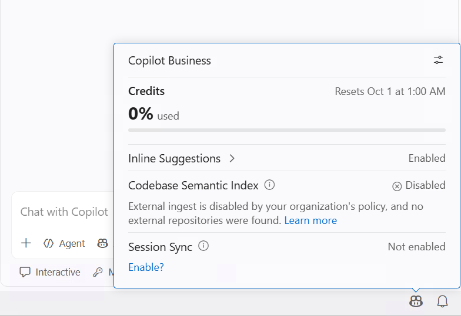

# MsftPowerBIStudy: Semantic Modeling with AI

You must complete these prerequisites successfully before proceeding to study participation.

## Laptop

- A Windows laptop, ideally with administrator permissions to install software
- A modern web browser, such as Microsoft Edge or Google Chrome

## Software

1. Download and install [GitHub Copilot App](https://github.com/features/ai/github-app).

<!--
1. Download and install the following applications.
   - [Visual Studio Code](https://code.visualstudio.com/download)
   - [GitHub Copilot App](https://github.com/features/ai/github-app)
-->

2. To install, [GitHub Copilot CLI](https://github.com/features/copilot/cli/), Open a terminal (`Win + X` > **Terminal**`) and run:

   

   ```powershell
   winget install GitHub.Copilot
   ```
   

<!-- 
   To install [Azure CLI](https://learn.microsoft.com/en-us/cli/azure/install-azure-cli-windows?view=azure-cli-latest&pivots=winget), run:

   ```powershell
   winget install --exact --id Microsoft.AzureCLI
   ```
-->

3. Run the following commands to install Fabric Skills and Power BI authoring plugin.

	```powershell
	copilot plugin marketplace add microsoft/skills-for-fabric	
	```

	```powershell	
	copilot plugin install powerbi-authoring@fabric-collection
	```

> [!TIP]
> You might see installation errors for software that is already installed. You can ignore these errors if you have confirmed that the required software is available on your computer and up to date.

> [!TIP]
> There are several ways to install skills and plugins. You can install them directly in Visual Studio Code. Installing the plugin through GitHub Copilot CLI is a simple way to make its skills and MCP server available across GitHub Copilot CLI, Visual Studio Code, and the GitHub Copilot app without installing duplicate copies.

## GitHub account and GitHub Copilot license

We will provide a GitHub Copilot license for the study. You can use your own license if you prefer.

> [!WARNING]
> Joining a study organization can affect an existing GitHub Copilot license on your account.
>
> - If you have a **GitHub Copilot Individual** subscription, your individual license will be cancelled and refunded after being added to the organization. Consider creating and using a separate GitHub account for study participation if you want to avoid impacting your current setup.
> - If you already have a **GitHub Copilot Business** or **GitHub Copilot Enterprise** license, you can choose which enterprise account should receive your Copilot charges in your Copilot settings: https://github.com/settings/copilot

To request a GitHub Copilot license for the study:

1. Open a browser and authenticate with a **personal GitHub account**. Enterprise Managed User accounts won't work. If you don't have a personal account, [sign up for GitHub](https://github.com/signup).
2. Open the [GitHub Copilot self-signup](#) and select **Sign in with GitHub**.

   

3. Follow the instructions, then select **Request organization invitation**.
4. Accept the organization invitation from your email or the self-signup page.
   
   
5. After joining the organization, open [Copilot features](https://github.com/settings/copilot/features) and verify that 10,000 AI credits are available.

   

> [!IMPORTANT]
> The GitHub Copilot license will only be valid during the study. Your access will be removed a few days later.


<!--
### Enable the GitHub Copilot license

1. Join the study GitHub organization.
2. Close all **Visual Studio Code** windows.
3. Open **Visual Studio Code**.
4. Open **GitHub Copilot Chat** (`Ctrl+Alt+I`).
5. Select **Sign in** in the VS Code status bar and use the GitHub account you associated with the study GitHub organization.

   

> [!IMPORTANT]
> You might already be signed in with another account. Sign out, then sign in with the account that you used to join the study GitHub organization.
>
> 

6. Click the Copilot icon in the VS Code status bar (bottom of the window).
   
   

7. Confirm that you can select a reasoning model provided for the study.

   

> [!NOTE]
> You might need to sign out, sign in again, and restart Visual Studio Code before the AI credits take effect.
-->

### Ensure GitHub Copilot App is ready

1. Open the **GitHub Copilot App**
2. Sign-in with your GitHub account
   
	

	Make sure you are signed in with the GitHub account you plan to use at the workshop.

	

3. Check the following MCP servers and plugins are installed by selecting **Customize** > **Installed**. The MCP servers should have a green checkmark to show they are connected using your GitHub Copilot account.
- Power BI Authoring MCP Server (Hosted)
- FabricIQ
- fabric-sqlendpoint
- fabric-skills
- powerbi-authoring

	

