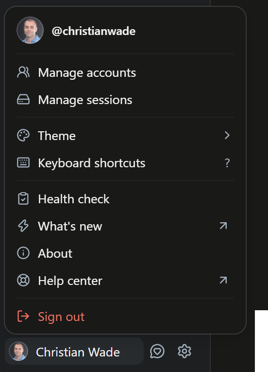
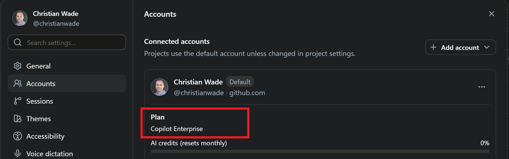
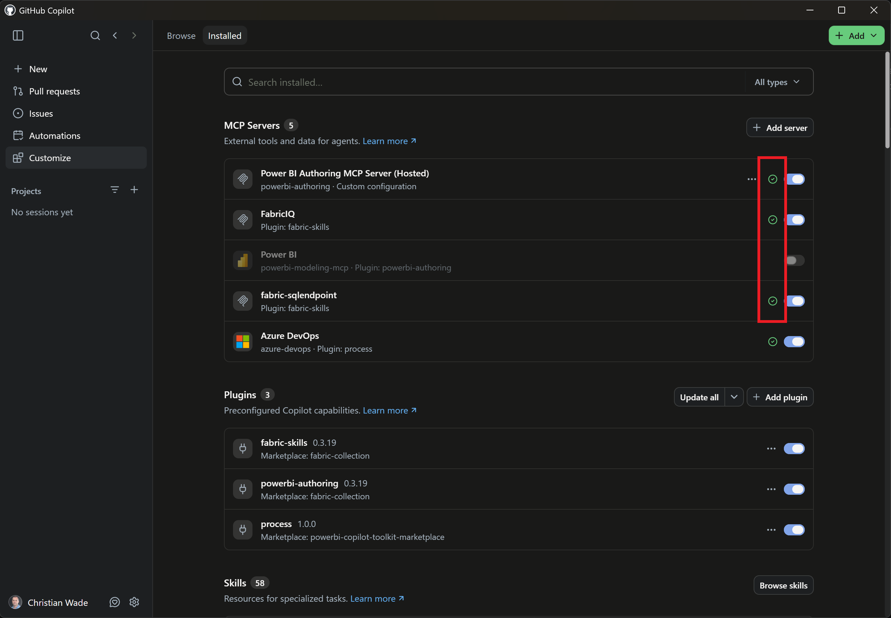
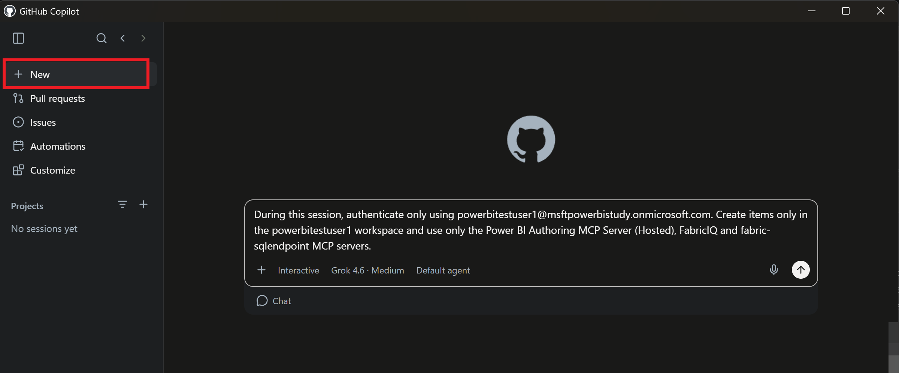

# Create Semantic Model with AI

### Sign into Fabric

Go to [Fabric](https://app.fabric.com) and sign in with the Entra ID account provided for the study. It will follow the following format.

`powerbitestuser<USER_NUMBER>@msftpowerbistudy.onmicrosoft.com`

Examples:

- `powerbitestuser1@msftpowerbistudy.onmicrosoft.com`
- `powerbitestuser25@msftpowerbistudy.onmicrosoft.com`

Replace `USER_NUMBER` to match the login provided in your study invitation.

### Fabric workspace

Create semantic models in the `powerbitestuser<USER_NUMBER>` workspace that is already created for you.

   

### GitHub Copilot App and Paid Copilot License

1. Open the **GitHub Copilot App**
2. Sign-in with your GitHub account that should have an associated paid Copilot license as set up in [Prerequisites](pre-requisites.md)
   
	

	Select the account in the bottom left and click Manage accounts.

	

3. Check you are not using a free Copilot license. The free Copilot license will not work for this study.

	

### MCP Servers and Plugins

Check the following MCP servers and plugins are installed by selecting **Customize** > **Installed**.

> [!NOTE]
> The MCP servers must be successfully connected to carry out the study. This is shown by the green checkmarks.

> [!NOTE]
> The [Power BI Modeling MCP](https://github.com/microsoft/powerbi-modeling-mcp) is a local MCP server and it must be ***uninstalled or disabled*** to carry out the study. You will get Power BI agentic modeling capabilitis from the Power BI Authoring MCP Server (Hosted) MCP server instead.

The MCP servers should have a green checkmark to show they are connected using your GitHub Copilot account.
   - Power BI Authoring MCP Server (Hosted)
   - FabricIQ
   - fabric-sqlendpoint
   - fabric-skills
   - powerbi-authoring



### Create semantic model using AI

Click New to start a new Copilot chat session. Enter the following prompt text. This is a safeguard to avoid cached credentials to other tenants,  associated previous Copilot usage memory and/or other previously installed MCP servers or plugins. Remember to replace `USER_NUMBER` to match the login provided in your study invitation.

```text
During this session, authenticate only using powerbitestuser<USER_NUMBER>@msftpowerbistudy.onmicrosoft.com. Create items only in the powerbitestuser<USER_NUMBER> workspace and use only the Power BI Authoring MCP Server (Hosted), FabricIQ and fabric-sqlendpoint MCP servers.
```



Create a semantic model called **ZavaSemanticModel-AI** based on the the [Semantic Model Requirements](semantic-model-and-query-requirements.md#semantic-model-requirements).

Once the model is created, create and execute queries based on the [Query Requirements](semantic-model-and-query-requirements.md#query-requirements). Place queries and results (copy/paste tables or screenshots) into a Word document with name as follows to be returned to your Microsoft study contact. Remember to replace `USER_NUMBER` to match the login provided in your study invitation.

`AI_QueryResults_powerbitestuser<USER_NUMBER>.docx`
