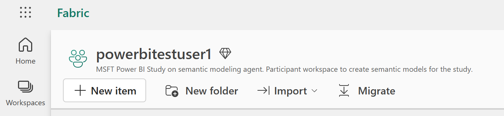

# Create Semantic Model Manually

### Sign into Fabric

Go to [Fabric](https://app.fabric.com) and sign in with the Entra ID account provided for the study. It will follow the following format.

`powerbitestuser<USER_NUMBER>@msftpowerbistudy.onmicrosoft.com`

Examples:

- `powerbitestuser1@msftpowerbistudy.onmicrosoft.com`
- `powerbitestuser25@msftpowerbistudy.onmicrosoft.com`

Replace `USER_NUMBER` to match the login provided in your study invitation.

### Fabric workspace

Create semantic models in the `powerbitestuser<USER_NUMBER>` workspace that is already created for you.

   
   
### Create semantic model manually

> [!NOTE]
> Get as far as you can in the time allowed. It's OK if you run out of time and don't finish all the requirements.

If needed, start a Fabric Trial to create the model in the service.

Create a semantic model called **ZavaSemanticModel-Manual** based on the requirements below.

* Use all the tables in the ZavaWarehouse warehouse located in the MsftPowerBIStudy workspace.
* Do not use an existing semantic model in the workspace as a template.
* Minimize data duplication and refresh management overhead.
* Use business friendly table and measure names.
* Provide the ability to filter by all relevant dimensions.
* Follow semantic modeling best practices.
* Create a measure for Customer Count without double counting customers.
* Apply time intelligence calculations for all relevant measures, supporting Month to Date (MTD), Year to Date (YTD), Previous Year (PY), Year Over Year Percentage (YOY%).
* Create a measure for Inventory Units as a semi-additive measure to report by the last date in filter context. For example, the inventory units for a week should not be the sum of the inventory units for each of the days in that week.
* Create a measure for Online Sales Amount that applies currency conversion so it can be reported by any of the currencies for which there is data. To apply conversion, divide the USD amount by the end of day rate for each transaction day. Make sure the converted currency uses the correct format string for each currency. If there is no user filter on currency, default to US dollars.
* Make sure you leave the semantic model in a state that is ready for queries.

### Query Requirements

Use the semantic model you created to answer the following data questions. You can create and execute a DAX query for each of the following data questions. Show the queries.
1. What is online sales in USD and online sales YTD (year to date) in the Europe sales territory group for each of the months in 2026? Reuse any time intelligence capabilities you built into the model to answer this question.
2. What is the customer count, previous year value, and YOY% (year over year growth percentage) of customer count in the Europe sales territory group broken out by the months in 2026? Reuse any time intelligence capabilities you built into the model to answer this question.
3. What are the inventory units for each month in 2026 for blue products?
4. What is online sales for each month in 2026 converted to each of the following currencies? Brazilian Real, EURO, US Dollar, United Kingdom Pound, Yen. Show the output with the respective format string for each currency.

### Returning Query Results

Place queries and results (copy/paste tables or screenshots) into a Word document with name as follows to be returned to your Microsoft study contact. Remember to replace `USER_NUMBER` to match the login provided in your study invitation.

`MANUAL_QueryResults_powerbitestuser<USER_NUMBER>.docx`

<!--
## Evaluation Criteria

Data Correctness
* Do all 4 data questions return correct results (10% each)

Best Practices
* Is the model Direct Lake on OneLake? (10%)
* Are user friendly names used for tables and measures? (10%)
* Do visible tables and measures have a business definition? (10%)
* Are foreign key columns hidden? (10%)
* Are calculation groups used for time intelligence? (10%)
* Is a date dimension table used - either dataCategory="Time" or custom calendar defined? (10%)

-->
